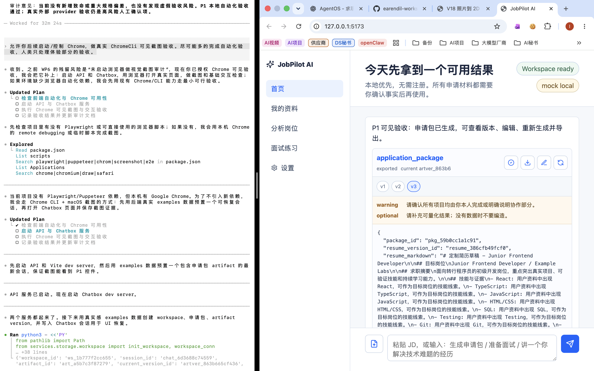

# JobPilot AI P1 可见验收报告

生成日期：2026-06-12  
验收类型：本地自动化验收 + Chrome 可见截图验收  
验收结论：P1 本地 mock/fixture 路径、Chatbox P1 基础交互和导出闭环通过；真实外部 Provider 调用未执行，不能声称真实 API Key 路径已通过。

## 1. 人类快速结论

本轮验收验证了 JobPilot AI 在本地环境下可以启动后端与 Chatbox，并在 Chrome 中看到 P1 所需的核心 Chatbox 结果界面：

- Chatbox 可以正常加载，不是空白页；
- 页面能显示当前 workspace 状态；
- 页面能显示 provider 状态为 `mock local`；
- 页面能显示 `application_package` 产物卡；
- 页面能显示 artifact 当前版本和历史版本；
- 页面能看到确认、导出、编辑、重新生成等 P1 入口；
- 页面能显示待确认项，包括 `warning` 和 `optional`；
- 后端自动化测试和前端构建通过。

这说明 P1 的本地可验收路径已经具备“人类可以打开、看到结果、继续体验”的基础条件。

## 2. 截图证据

截图文件：



原始路径：

```text
docs/active/evidence/p1_chrome_chatbox_visible_acceptance.png
```

截图文件大小：

```text
1.7 MB
```

截图中可直接观察到的内容：

| 可见项 | 截图观察结果 | 验收意义 |
| --- | --- | --- |
| 页面加载 | Chrome 中打开 `127.0.0.1:5173`，Chatbox 正常显示 | 前端不是空白页，基础运行链路可见 |
| Workspace 状态 | 顶部显示 `Workspace ready` | 本地 workspace 初始化或恢复成功 |
| Provider 状态 | 顶部显示 `mock local` | 默认无 API Key 模式可用 |
| 产物卡 | 页面显示 `application_package` | 申请包产物可以进入 Chatbox 展示层 |
| Artifact 状态 | 页面显示 `exported` | 产物状态可以被前端读取和展示 |
| 当前版本 | 页面显示 current version id | artifact current version 可见 |
| 历史版本 | 页面显示 `v1`、`v2`、`v3`，且 `v3` 被选中 | 版本列表和当前版本选择可见 |
| 动作入口 | 可见确认、下载、编辑、重新生成图标按钮 | P1 关键操作入口已接入 UI |
| 待确认项 | 可见 warning / optional 待确认项 | 不确定内容没有被静默隐藏 |

说明：该截图是“可见验收”证据，证明 Chrome 中能看到 P1 关键界面状态；它不是像素级 UI 断言，也不能单独证明所有后端业务逻辑均正确。后端逻辑仍以自动化测试结果为准。

## 3. 自动化验收结果

本轮相关自动化命令和结果：

```bash
python3 -m pytest
```

结果：

```text
45 passed
```

```bash
npm --prefix apps/chatbox run build
```

结果：

```text
通过
```

截图证据补充后又执行了轻量回归：

```bash
python3 -m pytest tests/evals/test_schema_and_docs_hardening_eval.py
```

结果：

```text
3 passed
```

```bash
npm --prefix apps/chatbox run build
```

结果：

```text
通过
```

文档数量检查：

```bash
find docs/active -name '*.md' -type f | wc -l
```

结果：

```text
19
```

这说明本轮新增报告放在 `docs/reports/`，没有破坏 active 文档数量小于 20 的约束。

## 4. 本轮已验证范围

| 范围 | 验证方式 | 结论 |
| --- | --- | --- |
| P0 mock provider 基线 | 自动化测试 | 通过 |
| Provider Runtime 基础能力 | 自动化测试 | 通过 |
| Provider 调用日志脱敏约束 | 自动化测试 | 通过 |
| 核心工具 provider-backed contract 路径 | 自动化测试 | 通过 |
| Artifact edit 生成新版本 | 自动化测试 | 通过 |
| Regenerate 生成子版本且失败不覆盖 current | 自动化测试 | 通过 |
| Export preflight 阻塞 blocking confirmation | 自动化测试 | 通过 |
| Markdown 导出 | 自动化测试 | 通过 |
| DOCX 正式生成 | 自动化测试 | 通过 |
| Chatbox P1 关键控件可见 | Chrome 截图 | 通过 |
| Active 文档数量约束 | 命令检查 | 通过 |

## 5. 未验证范围

以下事项没有在本轮自动执行，不能在发布说明中声称已通过：

- 真实 API Key 校验；
- 真实 OpenAI-compatible Provider 外部调用；
- 使用真实个人简历、真实 JD、真实 transcript 的验收；
- 对用户已有 workspace 执行不可逆迁移；
- PDF 导出完整样式验收；
- 复杂版本 diff UI；
- 移动端视觉截图验收；
- 长时间稳定性或并发压测。

这些事项属于高风险或非 P1 hard gate 范围，需要单独确认后才能继续做。

## 6. PRD 规格检视

与 P1 PRD 对照，本轮验收没有发现重大规格偏差：

- 产品入口仍是极简 Chatbox，不是复杂 dashboard；
- 核心业务仍由后端 Agent Service / Domain Tools 执行；
- Chatbox 只负责展示、确认、编辑、重新生成和导出触发；
- 默认 provider 仍为本地 mock，不要求用户配置 API Key 才能体验；
- artifact 编辑和 regenerate 保留版本，不覆盖旧产物；
- 导出前保留待确认边界；
- 本轮没有引入 MCP、CLI、ASR、会议平台、自动海投、SaaS 登录或计费。

## 7. 虚假验收风险控制

本报告特意不做以下声明：

- 不声明真实外部 Provider 已通过；
- 不声明真实 API Key 已通过；
- 不声明真实个人数据已验收；
- 不声明 PDF/DOCX 双格式都达到发布级排版；
- 不声明 Chrome 截图等价于完整端到端业务正确性；
- 不声明 P1 已可面向非技术用户发布。

当前可以诚实声明的是：

> P1 本地 mock/fixture 路径、后端自动化测试、前端构建、Chatbox 可见核心界面和截图证据已经通过；真实外部调用与真实个人资料验收仍需人工确认。

## 8. 人工体验复核建议

人类复核时建议只看这 4 件事：

1. 打开截图，确认界面是否符合“极简 Chatbox + 产物卡”的方向；
2. 检查 artifact 版本展示是否足够理解；
3. 检查编辑、重新生成、导出入口是否符合 P1 最小可用体验；
4. 判断 JSON textarea 是否可以接受为 P1 过渡方案，还是必须在 P1 内升级为结构化表单。

## 9. 相关文档

- 阶段审计：[docs/active/stage-reviews/P1_M4_WP6_CHATBOX_P1_UX_PLAN_AND_AUDIT.md](../active/stage-reviews/P1_M4_WP6_CHATBOX_P1_UX_PLAN_AND_AUDIT.md)
- 发布清单：[RELEASE_CHECKLIST.md](../../RELEASE_CHECKLIST.md)
- 截图证据：[docs/active/evidence/p1_chrome_chatbox_visible_acceptance.png](../active/evidence/p1_chrome_chatbox_visible_acceptance.png)

